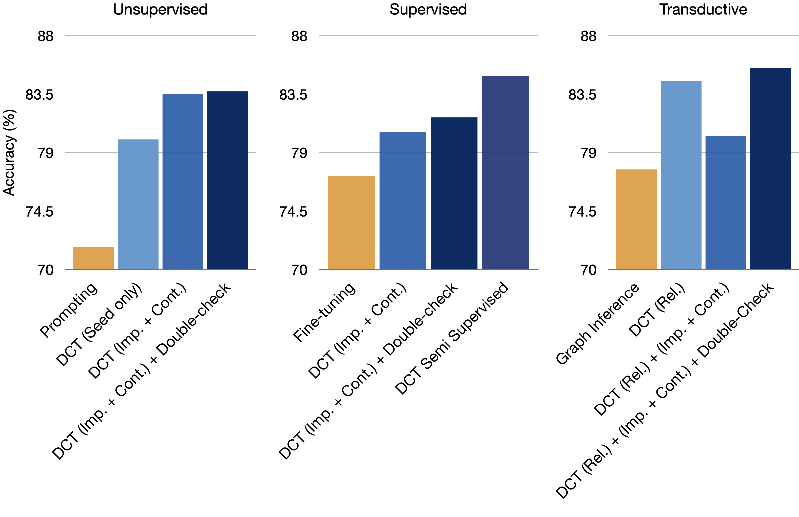

<p align="center">
  
  <figcaption>Figure 1: Overview of Deductive Closure Training (DCT). To improve coherence of language model predictions, we begin with a set of seed documents (pink-highlighted), then use an LM to generate a collection of statements implied by or contradicting these. Next, we find the most probable subset before fine-tuning the LM on the selected subset.</figcaption>
</p>

**Afra Feyza Akyürek, Ekin Akyürek, Leshem Choshen, Derry Wijaya and Jacob Andreas.**


<button name="button" onclick="https://arxiv.org/abs/2401.08574">Paper</button>       <button name="button" onclick="https://github.com/lingo-mit/deductive-closure">Code</button>

## Motivation

While language models (LMs) can sometimes generate factually correct text and estimate truth values of individual claims, these generally do not reflect a globally coherent, manipulable model of the world. As a consequence, current LMs also generate incorrect or nonsensical content, and are difficult to edit and bring up to date. We present a method called *Deductive Closure Training* (DCT) that uses LMs themselves to identify implications of (and contradictions within) the text that they generate, yielding an efficient self-supervised procedure for improving LM factuality.

## Highlights

Given a collection of seed documents, DCT prompts LMs to generate additional text implied by these documents, reason globally about the correctness of this generated text, and finally fine-tune on text inferred to be correct. Given seed documents from a trusted source, DCT provides a tool for supervised model updating; if seed documents are sampled from the LM itself, DCT enables fully unsupervised fine-tuning for improved coherence and accuracy. Across the CREAK, MQUaKE, and Reversal Curse datasets, supervised DCT improves LM fact verification and text generation accuracy by 3 - 26%; on CREAK fully unsupervised DCT improves verification accuracy by 12%. These results show that LMs' reasoning capabilities during inference can be leveraged during training to improve their reliability.


## Method
Figure 2 provides a detailed depiction of *Deductive Closure Training* operates. Given an initial seed document (which may be generated from the LM, left; or supplied by a trusted source, right), DCT generates a set of related text implied by or contradicting the seed document. At the same time, it assigns a score to each generated document (including possibly the seed) denoting the probability that it is true. Next, DCT identifies the subset of documents whose joint truthfulness score is highest, subject to the constraint that these documents are *logically coherent* (containing all implications and no contradictions). Finally, the LM is fine-tuned on this set.

<p align="center">
  
  
  <figcaption>Figure 2: Overview of Deductive Closure Training (DCT) procedure.</figcaption>
</p>


### Experiments
#### Fact Verification

We first evaluate whether AC improves models' ability to classify factual claims as correct or incorrect. Our experiments use [CREAK](https://arxiv.org/abs/2109.01653), a dataset of claims about entities. We investigate four different learning settings: unsupervised, supervised, semi-supervised, and transductive, each using a different procedure for sampling seed documents. All results are presented in Fig. 3. In the unsupervised setting where the seed documents are sampled from the model itself, the full method substantially outperforms a few-shot prompting baseline.

In the supervised case, we utilize a small set of externally provided claims and associated ground-truth labels to initialize DCT seed nodes. For semi-supervised learning, we pool together data generated following the unsupervised and supervised settings for fine-tuning. All variants of DCT improve over an ordinary fine-tuning baseline; interestingly, examples generated supervisedly and self-supervisedly are complementary, such that semi-supervised learning improves over both results.

Finally, we study the behavior of AC in a "transductive" setting in which we have access to *unlabeled* claims from the evaluation set while updating the model. For each claim in the validation set, we generate seed text by prompting the LM to generate a set of *related* claims, which are then used to generate additional implications and contradictions. As in other experiments, DCT outperforms the inference-time reasoning baseline as well as the related-text-only ablation.

<p align="center">
  
  <figcaption>Figure 3: Results for fact verification using CREAK dataset.</figcaption>
</p>


#### Model Editing
There has been increased interest in specialized continual learning (or "model editing") procedures for updating LMs with new information provided in natural language without full re-training. Our experiments on this task use the counterfactual subset from [MQUaKE](https://arxiv.org/abs/2305.14795) dataset, which evaluates models on their ability to answer questions about new information not provided in their training sets. To apply DCT for model-editing, we take the text of the new information to be seed documents. During the generation phase the model is prompted to combine this information with other related background information producing what we term *Correlative Implications*.

As shown in Fig. 4, DCT significantly outperforms fine-tuning on edits, fine-tuning on continuations, and MeLLo (the previous state-of-the-art on MQUaKE). Using correlative implications systematically improves over simple implications. Combining the two sets improves on average over using either in all settings.

<p align="center">
  
  <figcaption>Figure 4: Results for model editing using MQUaKE counterfactual subset.</figcaption>
</p>

#### Sanity Checks for Consistent Model Updating
In addition to naturalistic question asking tasks like MQUaKE, there has been recent interest in developing precise tests of LMs' ability to capture simple logical implications of new facts (e.g. assigning high probability to sentences of the form *B is A* after training on sentences of the form *A is B*). We investigate whether DCT can address these issues using the [Reversal Curse](https://arxiv.org/abs/2309.12288) benchmark.

We report results on two evaluations: first, a set of celebrity parent-child pairs with training examples *Jennifer Lawrence's mother is Karen Lawrence* and test examples *Who is the child of Karen Lawrence?*; second, a set of entity-description pairs with training examples *Olaf Scholz was the ninth Chancellor of Germany* and cloze-style test examples *The ninth Chancellor of Germany is ___*.

Results are shown in Fig. 5. On average, DCT improves accuracy on reversed statements without significantly hurting performance on original questions. Notably, however, DCT with this general-purpose prompt does not completely solve this dataset, and we leave for future work the question of whether more extensive sampling or other procedures could further improve these results.

<p align="center">
  
  <figcaption>Figure 5: Results for the "Reversal Curse" datasets.</figcaption>
</p>

<!-- ### Sample Generations from DCT -->

### Citation
```
@article{akyurek2024deductive,
  title={Deductive Closure Training of Language Models for Coherence, Accuracy, and Updatability},
  author={Akyürek, Afra Feyza and Akyürek, Ekin and Choshen, Leshem and Wijaya, Derry and Andreas, Jacob},
  journal={arXiv preprint arXiv:2401.08574},
  year={2024}
}
```
